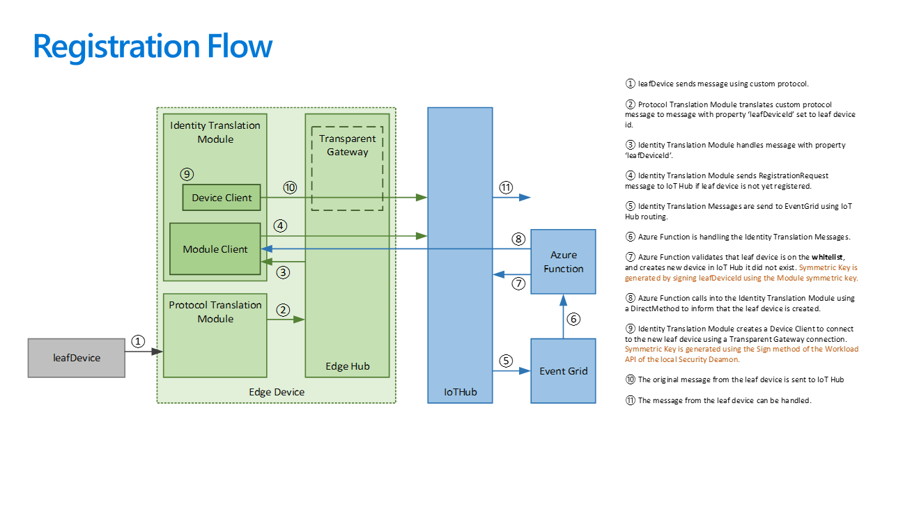
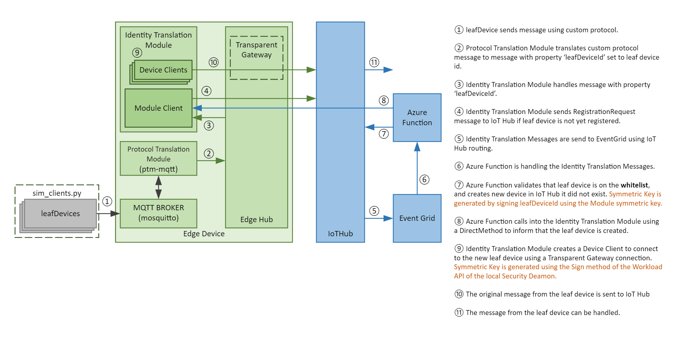

# Azure IoT Edge Identity Translation Lite: Sample on implementing Identity Translation at the edge

This sample builds the required components to support the Idenity Translation pattern with Azure IoT Edge. The [Identity Translation Pattern](https://docs.microsoft.com/bs-latn-ba/azure/iot-edge/iot-edge-as-gateway#patterns) is a pattern by which you have to implement both protocol translation as well as having the devices behind the protocol adopt an identity in IoT Hub. However, the devices themselves don't talk directly to IoT Hub, but rather get their identities impersonated by a custom module in IoT Edge.

This sample is a 'lite' implementation of the Identity Translation pattern as it only supports the basic identity translation flows based on symmetric keys. 

## Prerequisites

- An Azure account and access to a subscription where you can provision new resources (IoT Hub, Functions, Storage, Container Registry).
- Visual Studio Code if you want to run any parts of the sample locally.
- Docker Desktop for building the container modules (if not using the pre-built images).
- Azure Powershell az if you are running the automated sample.

## Setup

There are two ways of setting up a running demo:

- Automated sample setup can be found [here](/docs/autodeploy.md).
- There is also an option to setting up everything manually, including building the container images. You can find a [step-by-step guide here](/docs/stepbystep.md).

## Key concepts

For this Identity Translation Lite sample we are relying on a protocol translation module which is to be seen as something you can replace with your own module. This protocol translation module generates messages into edgeHub with certain headers. These messages can then be picked up by the second module: the [Identity Translation module](/docs/identitytranslationmodule.md).

The solution also comprises of a cloud section that takes care of provisioning the device on the IoT Hub and assigning it as a child of the IoT Edge device. To prevent any type of child device to be provisioned, there is a whitelisting file that validates whether the child device can be provisioned. This cloud solution leverages an [Azure Function](docs/functions.md) that gets triggered by an Event Grid subscription.

## Sample setup flow

The sample setup flow uses an unsecure MQTT broker connection (mosquitto) to interact with clients (represented by the Python script [sim_clients.py](/src/test/ptm-mqtt/sim_clients.py)) and a custom implemented protocol translation module ([ptm-mqtt](/src/edge/modules/ptm-mqtt)) to interact with the identity translation module. 

## Open points

This is a sample implementation of the Identity Translation pattern. The following functionalities are not implemented.
- DirectMethods to leaf devices
- DeviceTwins for leaf devices
- Persistance of leaf device registrations (the registration flow is initiated automatically when a leaf device starts sending messages)
- Disable or delete leaf devices in IoTHub
- The deployment ARM template refers to an external Git repo for Function deployment. Change once this repo is public.
- Automate the Python install and sample code run

## Contributing

This project welcomes contributions and suggestions.  Most contributions require you to agree to a
Contributor License Agreement (CLA) declaring that you have the right to, and actually do, grant us
the rights to use your contribution. For details, visit https://cla.opensource.microsoft.com.

When you submit a pull request, a CLA bot will automatically determine whether you need to provide
a CLA and decorate the PR appropriately (e.g., status check, comment). Simply follow the instructions
provided by the bot. You will only need to do this once across all repos using our CLA.

This project has adopted the [Microsoft Open Source Code of Conduct](https://opensource.microsoft.com/codeofconduct/).
For more information see the [Code of Conduct FAQ](https://opensource.microsoft.com/codeofconduct/faq/) or
contact [opencode@microsoft.com](mailto:opencode@microsoft.com) with any additional questions or comments.
