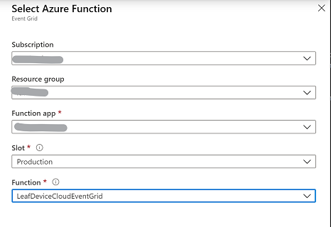

# Step-by-step manual setup of the IoT Edge Identity Translation Lite sample 

## Prerequisites

1. Clone this repo.
2. Install Visual Studio Code.
3. Install Azure IoT Tools extension in Visual Studio Code.
4. Install .NET Core 2.1 SDK.
5. Install C# for Visual Studio Code (powered by OmniSharp) extension.
6. Make sure you have the Azure Functions tools installed in Visual Studio Code.
7. Make sure you have Docker Desktop on your machine, we will need it for building and pushing the images.

## Setup

### Create Azure IoT Hub and register IoT Edge device
Note: if you already have an Azure IoT Hub account you wish to use you can skip this entire step.

1. Log into the Azure Portal and open up Cloud Shell with Bash. If you prefer you can use Azure CLI on your own machine.
2. Make sure you have installed CLI extension for Azure IoT: 
`az extension add --name azure-iot`
3. Create a new resource group: `az group create --name [your-resource-group-name] --location "[chosenregion]"`
4. Create Azure IoT Hub: `az iot hub create --name [hubname] --resource-group [groupname] --partition-count 2 --sku S1`
5. Register IoT Edge device: `az iot hub device-identity create --hub-name [hubname] --device-id edgeIdentityLite --edge-enabled`
6. Retrieve the connection string for the device, to be used later: `az iot hub device-identity show-connection-string --device-id edgeIdentityLite --hub-name [hubname]`


### Create Azure Storage Account
This account will host a whitelisting text file to contain the names of the devices that are considered as whiteliested.
1. Using Cloud Shell, create a new storage account: 
`az storage account create --name [storagename] --resource-group [resourcegroupname]`
2. Retrieve connection string:
 `az storage account show-connection-string --name [storagename]`. Copy the connection string to use in next statement.
3. Create a new blob container:
`az storage container create --account-name [storagename] --connection-string "[yourconnecstringstring]" --name whitelist`
4. Upload the file [whitelistitm.txt](../src/cloud/functions/whitelistitm.txt) to the Bash Cloud shell environment: click the Upload/Download Files icon and upload the before mentioned file.
5. Run the CLI for uploading to the container: `az storage blob upload --container-name whitelist --name whitelistitm.txt --file "whitelistitm.txt" --connection-string "[connection-string-for-storage]"`

### Create and Publish Azure Function

We will use Visual Studio Code to pre-configure the Azure Function to run locally in a subsequent step, as well as use VS Code to help us create and publish the Azure Function to Azure.

1. From this cloned repo, open the following project in Visual Studio code: /src/cloud/functions.
2. Rename the `local.settings.json.temp` file into `local.settings.json`.
3. We need to create a new access policy that has both ServiceConnect, RegistryRead and RegistryWrite permissions for connecting to IoT Hub: 
`az iot hub policy create --name functions2 --hub-name itmdocshub --permissions ServiceConnect RegistryRead RegistryWrite --resource-group itmdocs`
4. Retrieve the service connection string for IoT Hub using Cloud Shell again: `az iot hub show-connection-string --name [hubname] --policy-name service --key primary`
5. Update the settings as follows:
```
{
    "IsEncrypted": false,
    "Values": {
        "AzureWebJobsStorage": "[YOURSTORAGECONNECTION_STRING]",
        "FUNCTIONS_WORKER_RUNTIME": "dotnet",
        "IoTHubConnectionString" : "YOURHUBCONNECTION_STRING(created_above)",
        "WhitelistStorageConnection": "YOURSTORAGECONNECTION_STRING",
        "WhitelistContainerName": "whitelist",
        "WhitelistFilename": "whitelistitm.txt"
    }
}
```
6. Publish the Function via Command Palette (View > Command Palette). Start typing Azure Function and choose 'Azure Functions: Deploy to Function App...'.
7. Make sure you choose the option 'Create new Function App in Azure - Advanced'. This option allows you to select an existing resource group and more flexibility in settings.

8. Make your selection for these options:
    - Provide a function name: [yourunique_func_name]
    - Runtime: .NET Core 2.2
    - OS: Windows
    - Hosting plan: Consumption
    - Select resource gruop: make sure you select the resource group created in the first part of this guide.
    - Create or choose an existing storage account.
    - Create a new Application Insights instance.
    - Select the same location (region) as where you deployed your resource group.
9. This will take a few minutes. When finished, you will see a confirmation at the bottom right. From there you have an option to Upload Settings (configuration settings), click this to push your local.settings.json configuration. 

Typically you can choose not to overwrite the Storage setting as this one has been set when creating the Azure function.


### Configure Event Grid Subscription
We'll use the Azure Portal to implement this section.

1. In Azure Portal, open your IoT Hub and choose Events.
2. Choose 'Create new subscription'.
3. Provide a name and make sure you select only 'Device Telemetry' for the the filter to event types.

4. Under the section 'Endpoint details', leave it to Azure Function and click 'Select an endpoint'.
5. Choose the deployed Azure Function app. Under the Function dropdown you should see the LeafDeviceCloudEventGrid listed.

6. Confirm selection and then click 'Create'.
7. Back on the Events screen, you can click Event Subscriptions, it should now show the newly created subscription.
8. Next we want to filter the types of telemetry messages sent to Event Grid. We can do this using Event Grid subscription filters, but in our case we want to prevent sending all messages to the Event Grid endpoint so we will configure filtering at the IoT Hub 'Route' level.
    - Go to 'Message routing'. You should see a newly created route 'RouteToEventGrid'. Click on this route to open the details.
    - Change the Query section to the following: `itmtype = 'LeafEvent'`.
    - Click Save.

### Create Azure Container Registry

1. Using Azure Cloud Shell, run the following command to create your Azure Container registry: `az acr create --resource-group [your_resource_group_name] --name [acr_name] --sku Basic --admin-enabled true`
2. Retrieve the username for logging into the registry in subsequent steps, and keep it handy: `az acr credential show --name [your_acr_name] --query username`
3. Retrieve the password: `az acr credential show --name [your_acr_name] --query passwords[0].value`
4. Retrieve the login server address: `az acr show -n [your_acr_name] --query loginServer`


### Install and configure Azure IoT Edge on VM

1. Follow the Prerequisites step in this [quickstart](https://docs.microsoft.com/en-us/azure/iot-edge/quickstart-linux#prerequisites). This will create the Azure Ubuntu based VM to run the sample on.
2. Follow the step 'Configure your IoT Edge device' in the same [quickstart](https://docs.microsoft.com/en-us/azure/iot-edge/quickstart-linux#configure-your-iot-edge-device).
3. Take note of the publid IP address as you will need it below.
4. You now have a VM running, and we will deploy our modules to this in the next step.

### Deploy IoT Edge modules

In this section we will use Visual Studio Code to configure, build and deploy the custom Identity Translation Lite modules. For this sample we also include an MQTT broker to serve as an unsecured entry point to messages from clients. Consider this MQTT broker, as well as the MQTT translation protocol module as samples, these will typically be replaced by your own protocol that you want to bridge.

1. In Visual Studio Code, open the folder /src/edge/ from this cloned repo.
2. Configure the local environment settings:
    - Create a new .env file (or rename the supplied `.env.temp` one)
    - Copy the variables from `.env.temp` and fill in the Azure Container registry username, password and login server with the values you retrieved above.
3. Login into the server with docker, open the Terminal in Visual Studio Code: `docker login [your_acr].azurecr.io -p "[YOURPWD]" -u itmdocsarc`
4. Review the deployment template `deployment.debug.template.json`: this one contains:
    - Identity Translation Module (`itm`): this is the core of the solution taking care of doing identity translation, sending a creation message to the cloud (for provisioning and child device assignment), and some caching of messages while the device is under creation.
    - Protocol Translation Module `ptm`: this is a sample that reads messages from an MQTT Mosquitto broker installed on the Edge as an additional module. It puts messages into edgeHub for further processing by the Identity Translation module.
    - Mosquitto: this is a standard Eclipse Mosquitto MQTT broker, which unsecure clients (our Python code) will connect to.
    - Simulated temperature sensor: added as an additional module that sends its messages upstream.
5. In Visual Studio, make sure you configure the Azure IoT Hub extension to be connected to your newly created hub. Open Command Palette, type `Azure IoT Hub: Select IoT Hub`. Select your hub to persist.
6. Right-click the `deployment.debug.template.json` file and choose 'Build and Push IoT Edge Solution'. This step builds the container images `itm` and `ptm` and pushes them to your configured Azure container registry.
7. Now we can deploy to our IoT edge VM, there is now a configuration file under `/.confg/deployment.debug.amd64.json`. Right-click this file and choose 'Create deployment for single device'.
8. In the dropdown on the command palette, select your edge device 'edgeIdentityLite'.
9. Validate the modules got deployed and are running, either through the Azure Portal, or by SSH into your VM.
    - Via Cloud Shell run the ssh command to log into the machine `ssh azureuser@[yourvmipaddress]`
    - Run the command `iotedge list` to view the running modules. You should see 4 modules running. Note it can take 30 seconds to a few minutes to get all the containers running.


### Install Python and simulation script on VM
Note: we use the same VM as the one running IoT Edge for ease of use. You could also run the client MQTT client scripts on another machine but then you would need to configure networking to allow incoming traffic on the VM.

1. Log into the Edge VM, if you are not yet logged in.
2. Install Python

## Run the sample and simulate clients


